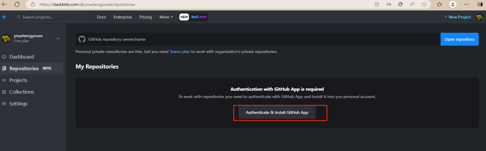

# 新建空项目
- 在线编辑 https://stackblitz.com/	19722008@163.com mikejs/Y龙年

## 关联github
,github上项目名为 mikejs

## 克隆到本地
```sh
# 新建空目录 mkdir mikejs进入后，pnpm init
echo "# mikejs" >> README.md
git init
git add README.md
git commit -m "first commit"
git branch -M main
git remote add github git@github.com:youshengyouse/mikejs.git
git push -u github main
git branch dev
git checkou dev
```